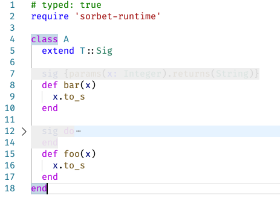

# ByeSig

VSCode plugin to say goodbye to the annoying Sorbet signatures.
For Ruby files it fades and folds Sorbet `sig` lines and blocks:

# Options

- Commands: force show and hide
- Configuration:
  - opacity
  - backgroundColor
  - plugin on/off
