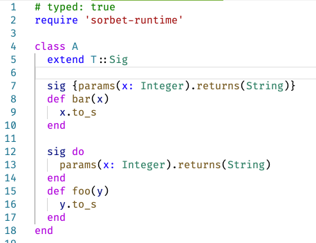
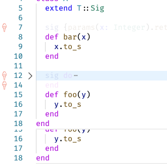

# ByeSig

ByeSig is a VSCode plugin to temporarily hide [Sorbet](https://sorbet.org/) signatures in Ruby source files.

When active it fades and folds Sorbet `sig` lines and blocks:

Before:

After:

# Options

- VSCode commands: force show and hide
- VSCode configuration:
  - opacity
  - backgroundColor
  - plugin on/off
  - fold on/off
  - gutter icon on/off

# Contribution

Still super beta, any feedback / issue / pull request is welcomed.
